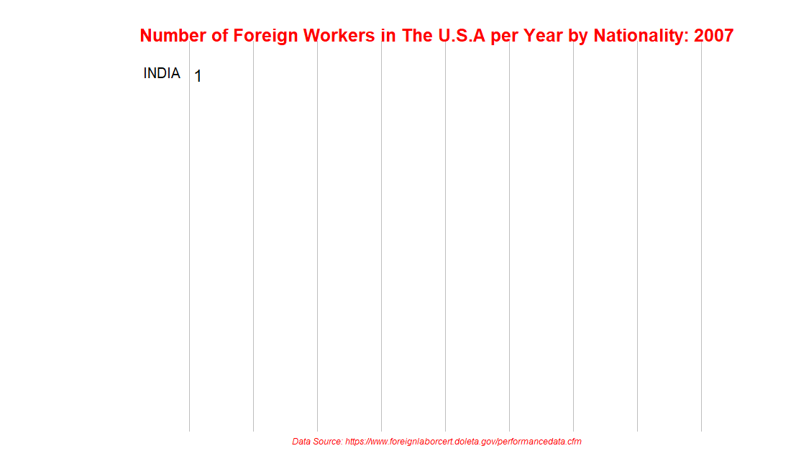

### #An exploratory data analysis of the foreign workers in the U.S. in recent years

#### This project is deployed as a Shiny dashboard at: https://xin-lin.shinyapps.io/foreign-worker/
#### Context:
A Program Electronic Review Management (PERM) Labor Certification issued by the Department of Labor (DOL) allows an employer to hire 
a foreign worker to work permanently in the United States. In most instances, the employer must obtain a certified labor from the DOL 
before submiting an immigration petition for the worker. 

#### Overview:
The U.S. has been the largest coutry for immigrants, with the steady growth of the foreign workers over the years. The purpose of this project is to explore the worker demographics and their salary levels, and find out the key factors determining their approval of the visas.

#### Data questions:
* The trends of foreign worker recruitment in the U.S.
  * Which state hires the most foreign workers
  * Which city hires the most foreign workers
  * Which company hires the most foreign workers
  * Which tpye of visa has the highest occurence 

* The qualificaitons of the applicants 
	* The education of the workers
	* The salary of the workers
	* Are the workers well paid?

* The attitude towards the workers between the Obama Administration and the Trump Administration
	* The comparison of the number of applicants being ceritfied 
	* The comparison of the wage of applicants being ceritfied  
	* The comparison of the processing time for applicants being ceritfied 

* What is the key factors determined the approval of PERM Labor Certification? 
#### Data source:
* UNITED STATES DEPARTMENT OF LABOR Employment & Training Administration (892175 X 155) 
Data covers 2006-2019 fiscal year and includes information on employer, position, wage offered, job posting history, employee 
education and past visa history, associated lawyers, and final decision(Certified or Rejected).
* Some figures for specific jobs are from The Glassdoor (e.g. the mean of salary for database engineer) 
